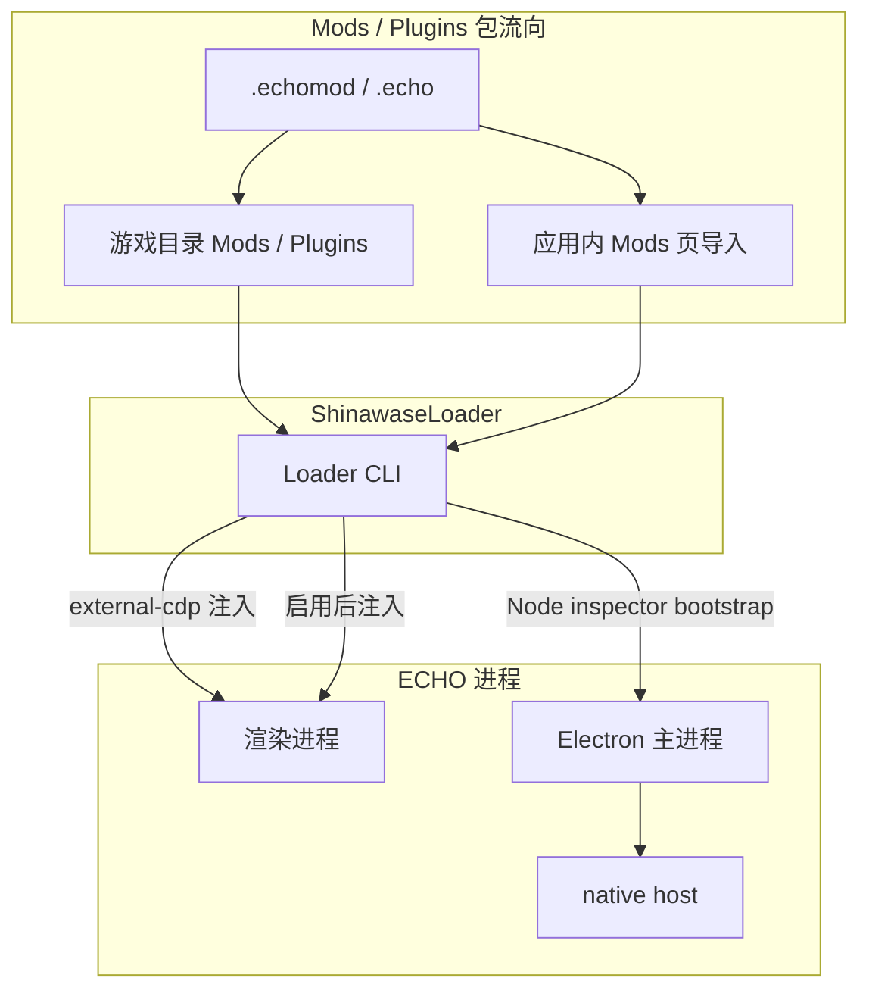

<div align="center">

# ShinawaseLoader

**ECHO Steam 的社区外部 ModLoader**

*Community external ModLoader for ECHO Steam — local CDP injection, no built-in plugin VM.*


[GitHub](https://github.com/ChunchunOwO/ShinawaseLoader) · 分支 `main` · Windows 与 macOS

</div>

ShinawaseLoader 是 ECHO Steam（当前验证 echo-steam **26.9.1**，Electron 43.3.0）的社区外部 ModLoader，**不使用 ECHO 内置插件 VM**。默认以本地 CDP 端口启动 ECHO，把启用的 Mod 注入主窗口渲染进程；HTML、CSS、JavaScript、WASM、侧栏页面与 `window.echo` 均可使用，且不修改 Steam 的 `ECHO.exe` / `ECHO.app` / `app.asar`。Steam 更新后会自动把隔离运行时（`modded-runtime`）同步到新的 asar 与可执行文件。userData 在 Windows 为 `%APPDATA%\ECHO Steam`，在 macOS 为 `~/Library/Application Support/ECHO Steam`（可用 `ECHO_USER_DATA_PATH_OVERRIDE`）。

> **v1.7.0**（当前）对齐 echo-steam 26.9.1。Loader 生成独立的 `ECHO.modded.exe`，**不取代** Steam 原版；安装结束后会指导把 Steam 启动项设为 `"…\ECHO.modded.exe" %command%`。侧栏 Mods 下方提供 **Mod Market**，从 `echo.shiinasuki.com` 浏览并一键安装 / 更新社区插件。双击该 exe 或 `start-echo-with-mods.cmd` 时会自动检查 GitHub 上的 Loader 与预装包并更新，Steam 更新后也会自动刷新隔离运行时。发现逻辑优先 `...\common\ECHO\ECHO.exe`，可用 `ECHO_ROOT` / `selection.json` / `--echo` 覆盖；Playtest 只能显式选择。自 **v1.6.0** 起提供注入 UI（Mods 管理页、配置弹窗、Loader 状态页）与 Mod 自定义配置页：清单声明 `"configUi": "config-ui.js"` 后，配置弹窗以 `echoConfigUi` 上下文执行该脚本；未提供或加载失败时自动回退到 `config.schema.json` 表单。详见 [`ShinawaseLoader/SDK.md`](ShinawaseLoader/SDK.md)。

## 目录

- [✨ 特性](#-特性)
- [🚀 快速开始](#-快速开始)
- [📦 安装 Mod](#-安装-mod)
- [🛠️ Mod 开发](#️-mod-开发)
- [🏗️ 架构](#️-架构)
- [📁 目录结构](#-目录结构)
- [🧩 示例 Mod](#-示例-mod)
- [❓ 故障排查](#-故障排查)
- [⚠️ 免责声明](#️-免责声明)
- [🤝 贡献](#-贡献)

## ✨ 特性

| 能力 | 说明 |
| --- | --- |
| **全新注入 UI** · v1.6.0 | 侧栏「Shinawase Loader」分组下提供 Mods 管理页、配置弹窗与 Loader 状态页（语言、调试、更新）。 |
| **Mod Market** · v1.7.0 | 侧栏 Mods 下方「Mod Market」。从官方目录浏览、搜索、安装和更新 `.echomod`，样式与 Mods 页同一套主题。 |
| **自定义配置页** · v1.6.0 | 清单字段 `configUi` 指向自定义脚本；失败时回退到 `config.schema.json` 自动渲染。 |
| 渲染进程注入 | 默认 `external-cdp`：经 Chrome DevTools Protocol 注入，不改 `ECHO.exe`。 |
| 主进程 bootstrap | Loader 启动 ECHO 时经 Node inspector（`--inspect`）加载 `streaming-bridge`、`native-host` 与额外 preload，不改写已安装的 `app.asar`。 |
| 原生能力 | in-process native host（`.node` addon / host-dll，导出 `EchoNative_Init`）；可选当前进程内存 API。 |
| 隔离运行时 | 安装时生成独立 `ECHO.modded.exe` + `modded-runtime`（不取代 Steam 原版）。推荐把 Steam 启动项设为 `"…\ECHO.modded.exe" %command%`。Steam 更新后启动前自动对照 asar/exe 指纹并重拷/重打补丁。 |
| 可逆自启 | 可选 `app-asar-bridge`（仅作用于隔离运行时副本）；CDP / inspector 模式不依赖它。 |
| 运行模式 | 安全模式、调试模式、`attach-only`；单实例监听端口 `17862`。 |
| 语言 | 首次运行选择中文 / English，写入 `%LOCALAPPDATA%\ShinawaseLoader\selection.json`，之后可在 Loader 页更改。 |

## 🚀 快速开始

Windows 安装程序会扫描 Steam 库定位 `ECHO.exe` / `ECHO Steam.exe`（优先 `D:\SteamLibrary\steamapps\common\ECHO\ECHO.exe`，不会因路径排序默默选中 Playtest），把 Loader 复制到游戏目录旁，并创建空的 `Mods`、`Plugins` 投放文件夹。若本机缺少 Node，会自动下载 **22.23.2** 到当前用户缓存。全程无需管理员权限。可用 `ECHO_ROOT`、`--echo` 或 `%LOCALAPPDATA%\ShinawaseLoader\selection.json` 覆盖目标。macOS 用下方的 shell 安装器，不走这套 PowerShell 菜单。

```powershell
git clone https://github.com/ChunchunOwO/ShinawaseLoader.git
cd ShinawaseLoader
.\setup-modloader.bat -Action menu
```

首次安装前可在主菜单选择「下载源」。默认使用镜像：Node 可选华为云、阿里云或 npmmirror，npm 包和原生构建头文件使用 npmmirror，Loader 自更新使用 ghproxy。也可选择「官方源（直连）」让这些下载全部走官方地址。选择保存在当前用户的 `selection.json`，安装器和已安装 Loader 的后续更新共用；已有缓存不会重复下载。Mod Market 的包仍由目录中各作者提供的地址下载。

安装结束后会进入 **可选包**：默认勾选 **ECHO Streaming** 和 **ECHO MV**。空格开关，Enter 导入到游戏 `Mods`。其他示例已归档为 [`examples/reference/`](examples/reference/) 参考 Mod，不出现在安装列表里。

Loader **不会取代** Steam 原版 `ECHO.exe` / `app.asar`。安装会在游戏目录旁生成独立的 `ECHO.modded.exe`（启动隔离运行时）。打完可选包后，安装程序会提示并把下面这一行复制到剪贴板——请写入 Steam 启动项：

```text
"<游戏目录>\ECHO.modded.exe" %command%
```

路径：Steam → 库 → ECHO → 属性 → 启动选项。之后在 Steam 点「开始游戏」即走独立启动器。Loader 设置页常驻「喵」启动项提示，**点击路径即可复制**（无右下角弹窗）。也可双击 `ECHO.modded.exe`，或使用 `ShinawaseLoader` 下的启动器：

| 启动器 | 用途 |
| --- | --- |
| `ECHO.modded.exe` | 独立主机（推荐配合 Steam 启动项） |
| `start-echo-with-mods.cmd` | 同步运行时后启动独立主机 |
| `start-echo-debug.cmd` | 调试模式 |
| `start-echo-safe.cmd` | 安全模式（不注入包、不加载 native host） |
| `attach-to-echo.cmd` | 附加到已在运行的 ECHO |

发布构建（产出 `release/ShinawaseLoader-<version>` 及 zip，对外分发请只用该目录）：

```powershell
.\build-release.bat
```

### macOS

macOS 安装器只认包含 `ECHO.app` 的目录（Steam 一般是 `~/Library/Application Support/Steam/steamapps/common/ECHO`，本地构建是 `dist/mac-arm64`）。它不编译 `ECHO.modded.exe`，也不改 Windows 安装脚本。本机需要已有的 Node **22.23.2**。

不传目录时，安装器会自己找：Steam `libraryfolders.vdf`、默认 Steam 库、`/Applications`、`~/Applications`、上次的 `selection.json`，以及 Spotlight 里标识为 `app.echo.steam` 的应用。Playtest 不会被自动选中。

```bash
./start-mac.command
```

在 Finder 里双击 `start-mac.command` 效果相同：找到 `ECHO.app` 后安装并启动。第一次会把附带的 ECHO Streaming 和 ECHO MV 导入并启用，侧栏里可以再开关。已经关掉的 Mod 不会被下次安装重新打开。已经知道目录时也可以指定：

```bash
./setup-modloader.sh --echo "<ECHO_ROOT>"
```

`<ECHO_ROOT>` 可以是内容目录、`ECHO.app`，或 `ECHO.app/Contents/MacOS/ECHO`。安装会在该目录旁写入 `ECHO.modded.command`、`ShinawaseLoader/`、`Mods/` 和 `Plugins/`。隔离运行时放在 `ShinawaseLoader/modded-runtime/`，是一份独立的 `ECHO.app` 副本。补丁只写在这份额外副本上，副本会单独重新签名，Steam 里的原始 `ECHO.app` 不会被修改。从 Steam 里直接点「开始游戏」开的是原版；要用 Mod，请双击 `ECHO.modded.command`，或把启动项设成：

```text
"<游戏目录>/ECHO.modded.command" %command%
```

也可以直接双击 `ECHO.modded.command`。调试、安全模式和附加启动器在 `ShinawaseLoader/` 下，扩展名是 `.command`。原生 host（`echo-native-host.node` / host-dll）仍只在 Windows 上构建；没有对应的 Darwin 插件时，macOS 会跳过它，CDP 注入照常进行。Loader 自己的选择记录在 `~/Library/Application Support/ShinawaseLoader/selection.json`。

### 命令行旗标

```text
--echo --safe-mode --debug --load-mode --inject-interval --startup-delay
--native-port --inspect-port --no-native-host --locale
```

`node ShinawaseLoader.mjs sync-runtime [--force]` 对照 Steam 的 `app.asar` / `ECHO.exe` 指纹，刷新隔离运行时。Steam 更新后启动 `start-echo-with-mods.cmd` 或 `ECHO.modded.exe` 也会自动做这一步。

`node ShinawaseLoader.mjs self-update [--force]` 从主菜单选定的下载源更新 Loader 与预装包。双击 `ECHO.modded.exe` 时默认自动执行；可在 `loader.config.json` 设 `"autoUpdate": false` 关闭。

`--load-mode` 取值：`external-cdp`（默认）、`attach-only`、`disabled`。

## 📦 安装 Mod

任选其一：

1. 安装 Loader 时在 **可选包** 勾选 ECHO Streaming / ECHO MV（默认勾选），脚本会把对应 `.echomod` 导入游戏 `Mods`。
2. 用 Loader 启动 ECHO 后，打开应用内侧栏 **Mod Market**，从官方目录一键安装或更新。
3. 打开应用内 **Mods** 页，导入 `.echomod` / `.echo`（也支持拖放）。
4. 把包文件丢进游戏目录的 `Mods` 或 `Plugins` 文件夹，渲染进程就绪后会注入已启用的包。

成品预装包在 [`examples/packages/`](examples/packages/)。参考 Mod 在 [`examples/reference/`](examples/reference/)。`examples/` 源码目录不会被复制进安装位置，只有勾选的可选包会被导入。

Mod Market 目录默认是 [`https://echo.shiinasuki.com/mod-market/`](https://echo.shiinasuki.com/mod-market/)。网页和 Loader 都提供搜索、推荐和上传。可用 `loader.config.json` 的 `marketUrl` 或环境变量 `ECHO_MOD_MARKET_URL` 覆盖目录地址。重新生成静态目录：

```powershell
node .\scripts\build-mod-market.mjs
```

## 🛠️ Mod 开发

复制 [`ShinawaseLoader/mod-template`](ShinawaseLoader/mod-template) 或 [`ShinawaseLoader/plugin-template`](ShinawaseLoader/plugin-template)，按需修改清单与入口。

模板目录（`mod-template`）：

```text
echo.mod.json          # 清单（id / name / version / entry / config …）
config.json            # 可编辑默认配置
config.schema.json     # 可选；Mods 页自动渲染表单
mod.js                 # 渲染进程入口，收到 echoExternalMod
icon.svg
README.md
```

Plugin 使用 `echo.plugin.json` + `plugin.js`，SDK 与 Mod 相同。需要主进程或 host-dll 时，复制 [`ShinawaseLoader/native-plugin-template`](ShinawaseLoader/native-plugin-template)。

`mod.js` / `plugin.js` 收到的 `echoExternalMod` 包括：`echo`、`player`、`extend`、`sidebar`、`main`、`native`、`sdk`、`settings`、`assetUrl` / `loadAsset`、`fetchJson`、`toast`、`log` 等。编辑器类型见 [`ShinawaseLoader/echo-external-mod.d.ts`](ShinawaseLoader/echo-external-mod.d.ts)，完整说明见 [`ShinawaseLoader/SDK.md`](ShinawaseLoader/SDK.md)。入口若创建了 DOM、定时器、监听或侧栏页，应返回清理函数。

打包：

```powershell
.\pack-mod.bat .\MyMod .\MyMod.echomod --zip
```

### 自动化测试 SDK（Testing SDK）

`ShinawaseLoader/testing/` 提供面向自动化工具与 AI Agent 的测试 SDK：离线仿真 harness（在与 Loader 完全一致的 `echoExternalMod` 包装内执行入口、记录全部 SDK 调用、审计清理泄漏，带虚拟时钟）、静态校验（manifest / 入口语法 / `.echomod` 归档，规则镜像 Loader），以及 attach-only 真机验收客户端（导入→启用→探测→可信输入→截图→清理验证；绝不杀进程，启动/关闭 ECHO 需显式旗标且带所有权跟踪）。零 npm 依赖，仅 loopback，无任何外发数据。

```powershell
node .\ShinawaseLoader\testing\cli.mjs check .\MyMod          # 离线：清单 + 包装语法 + 冒烟 + 泄漏审计
node .\ShinawaseLoader\testing\cli.mjs accept .\MyMod --json  # 真机：附加到运行中的 Loader 做验收
node --test "tests/*.test.mjs"                                # 仓库自测（纯离线）
```

也可用根目录 `test-mod.bat`。退出码：0 通过 / 1 失败 / 2 用法错误 / 3 真机环境不可用（如实标注跳过而非假绿）。`--json` 输出 `reportVersion: 1` 结构化报告（含截图工件与环境元数据，供视觉模型阅读）。完整契约见 [`ShinawaseLoader/TESTING.md`](ShinawaseLoader/TESTING.md)，编辑器类型见 [`ShinawaseLoader/testing/shinawase-testing.d.ts`](ShinawaseLoader/testing/shinawase-testing.d.ts)。测试文件请放在包目录之外（沿用 `echomod/` 与 `dev/` 并列的布局）。

测试 SDK 随项目提供，普通 Loader 启动不会加载它。离线检查使用模拟环境；真机验收会实际操作选定的 ECHO 和包目录。`accept`、`shot` 或 `openSession()` 连接到主窗口后，会在顶部显示「本实例正在用于自动化测试」（英文环境显示英文提示），包括附加到已有实例的情况。提示不截获点击、不改变页面布局，并会出现在窗口截图中；会话关闭时移除，页面刷新后自动恢复。测试进程异常退出或断连时，提示会在最后一次心跳约 10 秒后自动清理（窗口挂起或计时器受限时可能延后）。普通启动、离线检查和 `doctor` 不显示此提示。

提示本身不代表数据隔离。`--isolated-user-data` 和 `--isolated-store` 只对测试会话新启动的 Loader 生效；附加到已有 Loader 时仍使用它原来的用户数据和包目录。

### 自定义配置页（v1.6.0）

在清单中声明 `configUi`。该脚本在配置弹窗中以 `echoConfigUi` 上下文执行（`root` / `config` / `schema` / `save` / `close` / `onSave` / `assetUrl` 等）。未提供该字段或脚本加载失败时，Loader 回退到 `config.schema.json` 的自动渲染表单。

```json
{
  "id": "com.example.echo-mod",
  "name": "Example ECHO Mod",
  "entry": "mod.js",
  "config": "config.json",
  "configSchema": "config.schema.json",
  "configUi": "config-ui.js"
}
```

```js
const { root, config, onSave } = echoConfigUi;

root.innerHTML = `
  <label>
    消息
    <input id="message" type="text" />
  </label>
`;
root.querySelector('#message').value = config.message == null ? '' : String(config.message);

onSave(() => ({
  ...config,
  message: root.querySelector('#message').value,
}));
```

上下文与回退规则的完整说明见 [`ShinawaseLoader/SDK.md`](ShinawaseLoader/SDK.md)。

### 原生扩展

- native host：包内 `.node` addon 或 host-dll（须导出 `EchoNative_Init`），由 inspector bootstrap / 可选 asar-bridge 在 ECHO 主进程内加载。
- 当前进程内存 API：清单 `native.memory: true`，且 `loader.config.json` 中 `nativeMemoryApi` 为开；仅操作 ECHO 自身进程。
- 构建 host addon：`.\scripts\build-native-host.ps1`
- 完整模板：[`ShinawaseLoader/native-plugin-template`](ShinawaseLoader/native-plugin-template)

安全模式与 `--no-native-host` 会关闭原生加载。

## 🏗️ 架构

默认路径不修改 `ECHO.exe`，也不改写已安装的 `app.asar`。可选的隔离运行时与 `app-asar-bridge` 是旁路，不是 CDP / inspector 的前置条件。



- **CDP 注入**：HTML / CSS / JS / WASM、侧栏页面、`window.echo` 均在渲染进程可用。
- **inspector bootstrap**：启动时带 `--inspect`，在主进程求值 `main-bootstrap.cjs`，注册 streaming / account IPC、`streaming-preload.cjs` 与 native host。
- **单实例**：Loader 监听 `17862`；日志写入 `ShinawaseLoader/Logs/loader.log` 与 `errors.log`。

## 📁 目录结构

```text
.
├── ShinawaseLoader/           # Loader、SDK、模板、native host、inspector bootstrap
│   ├── ShinawaseLoader.mjs
│   ├── SDK.md
│   ├── TESTING.md
│   ├── echo-external-mod.d.ts
│   ├── loader-ui.js
│   ├── loader.config.json
│   ├── loader-version.json
│   ├── main-bootstrap.cjs
│   ├── native-host.cjs
│   ├── native-shell-host.cjs
│   ├── streaming-bridge.ts
│   ├── streaming-preload.cjs
│   ├── testing/               # 自动化测试 SDK（harness / validate / client / session / cli）
│   ├── mod-template/
│   ├── plugin-template/
│   ├── native-plugin-template/
│   └── native/
├── scripts/                   # 安装 / 打包 / 发布
│   ├── setup-modloader.ps1
│   ├── pack-echomod.mjs
│   ├── build-release.ps1
│   ├── build-native-host.ps1
│   ├── build-streaming-bridge.mjs
│   ├── cdp-eval.mjs
│   └── verify-echo-runtime.mjs
├── examples/                  # 官方示例（不随安装复制）
│   ├── ECHO-MV/
│   ├── ECHO-Streaming/
│   ├── packages/              # 预装包：Streaming / MV
│   └── reference/             # 归档参考 Mod（不进安装器可选包）
├── tests/                     # 仓库自测（node --test "tests/*.test.mjs"，纯离线）
├── setup-modloader.bat
├── pack-mod.bat
├── test-mod.bat
└── build-release.bat
```

## 🧩 示例 Mod

源码在 [`examples/`](examples/)，打包说明见 [`examples/README.md`](examples/README.md)。安装脚本「可选包」只提供下面两个，默认勾选。

从仓库根目录打包预装示例：

```powershell
.\pack-mod.bat .\examples\ECHO-Streaming\echomod .\examples\packages\ECHO-Streaming.echomod --zip
.\pack-mod.bat .\examples\ECHO-MV\echomod .\examples\packages\ECHO-MV.echomod --zip
```

Pet、osu!downloader、AudioBand、Wallpaper Bridge、Together、Steam Listen Board、Auxiliary Fix 已归档为参考 Mod，见 [`examples/reference/`](examples/reference/)。不出现在安装器可选包中。

## ❓ 故障排查

**安全模式仍想启动 ECHO，但不加载任何包？**  
使用 `start-echo-safe.cmd`，或加上 `--safe-mode`。安全模式同时关闭 native host。

**ECHO 已经打开，只想挂上 Loader？**  
使用 `attach-to-echo.cmd`，或 `--load-mode attach-only`。附加模式不会再拉起一份 ECHO。

**Mod 没有生效？**  
确认 Steam 启动项已设为 `"<游戏目录>\ECHO.modded.exe" %command%`，或双击了 `ECHO.modded.exe` / `start-echo-with-mods.cmd`。未改启动项时，Steam 原版入口不会走隔离运行时与 inspector bootstrap。

**ECHO 43.3+ 双击 `ECHO.modded.exe` 立刻退出？**  
新版 Electron 会校验 `app.asar` 的 header hash 和每个文件的 SHA256 blocks。隔离运行时必须使用独立的 `ECHO.exe` 副本；打补丁时会重算文件 integrity 并同步 exe 内的 header hash，不要 hardlink Steam 原版 exe。Steam 更新后 Loader / `ECHO.modded.exe` 会自动对照指纹并调用 `runtime-sync.mjs`；也可手动 `node ShinawaseLoader.mjs sync-runtime --force`。

**日志在哪里？**  
游戏目录旁：`ShinawaseLoader/Logs/loader.log`（运行与包日志）、`ShinawaseLoader/Logs/errors.log`（仅错误）。

**语言选错了？**  
删除或编辑 `%LOCALAPPDATA%\ShinawaseLoader\selection.json`，或在应用内 Loader 页切换。也可用 `--locale`。

**需要卸载 Loader？**  
通过 `.\setup-modloader.bat -Action menu` 选择卸载。Mods / Plugins 文件夹会保留。

## ⚠️ 免责声明

ShinawaseLoader 是独立的社区工具，与 ECHO 本体及其内置插件系统分属不同项目；它不是 ECHO 的官方组件，其开发、分发和维护不代表 ECHO 官方。

请仅在遵守适用法律、ECHO 使用规则及相关权利人授权的前提下使用。严禁将 ShinawaseLoader 或通过它加载的内容用于违法行为、商业经营或盈利、侵犯著作权等知识产权、未经授权访问或修改他人系统、侵犯隐私，以及传播恶意内容。第三方 Mod / Plugin 由各自作者提供；用户应自行确认其来源、权限与使用条件，并对自己的使用行为负责。

每次打开安装器时会要求确认免责声明。只有选择「同意并继续」才能使用安装器；选择「不同意并退出」、按 Esc 或关闭窗口，本次操作立即结束。通过 `ECHO.modded.exe`、Steam 启动项或 Loader 命令启动时不会重复询问。

本工具仅向用户本机的 ECHO 实例注入已启用的社区包。默认路径不修改 `ECHO.exe`，也不改写已安装的 `app.asar`。可选的 `app-asar-bridge` 与隔离运行时 `ECHO.modded.exe` 均可逆；运行日志位于 `ShinawaseLoader/Logs/`，卸载 Loader 时会保留 Mods / Plugins 文件夹。

## 🤝 贡献

欢迎在 [GitHub Issues](https://github.com/ChunchunOwO/ShinawaseLoader/issues) 报告问题，或基于 `main` 提交 Pull Request。请说明变更目的与验证方式；文档与示例请与现有风格保持一致。
